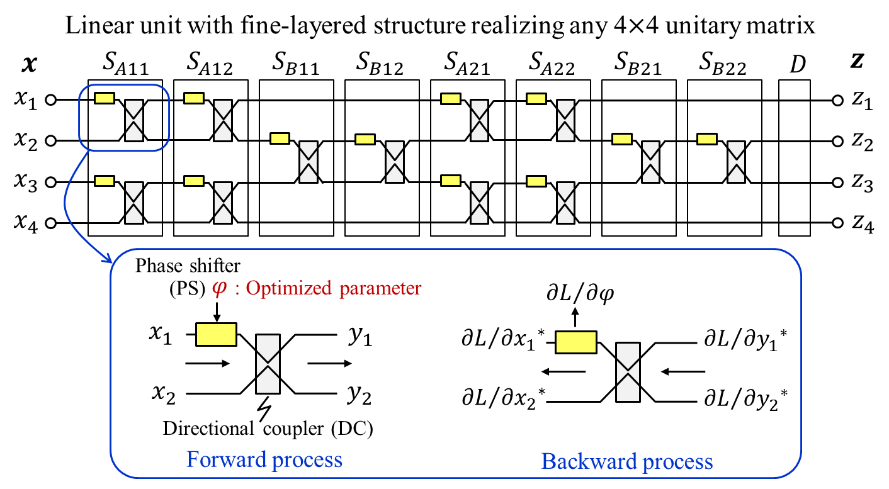
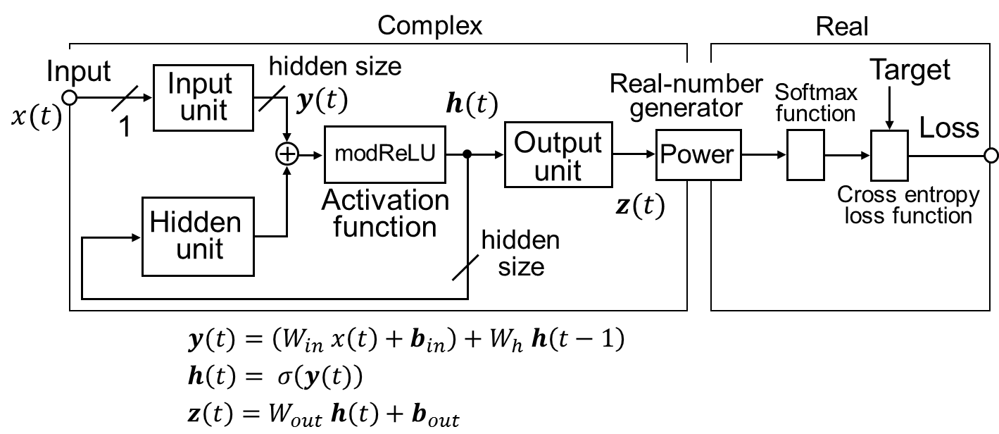

# Acceleration Method For Learning <br> Fine-Layered Optical Neural Networks
This is a code set for appying our acceleration method 
to Elman-type **recurrent neural networks (RNNs)** whose **hidden unit** is an **optical unit**
with a **fine-layered structure**.
The codes are implemented with PyTorch 1.7.0 and later.
<!---  --->


## Requirements for executing PyTorch codes
1. OS: Ubuntu 18.04 LTS and later (including 20.04 LTS)
2. g++ (GCC): >= 8.2.0
3. Python: >= 3.8.5
4. PyTorch: >= 1.7.0
5. Others listed in [requirements.txt](requirements.txt)

## Download
- Use ``git clone`` or ``Download ZIP`` to get whole the files.

## Quick start
1. Execute rnn.py by ``python rnn.py``<br>
  ``rnn.py``: Elman-type <a href="./Images/rnn.png" width="50%" target="_blank">RNN</a> whose hidden unit is PSDC-based optical unit<br>
where its hidden size (dimensionality) is only **32** and the number of fine layers is **four**.<br>
	  
  If you fail to load the MNIST database in your first execution, 
  the database will be automatically downloaded into your current directory.<br>
2. Confirm log file of ``./Log/rnn.log``.
	<a href="./Images/rnn_exe_log.png" width="70%" target="_blank">Execution log</a> and 
	<a href="./Images/rnn_acc_epoch.png" width="40%" target="_blank">Figure</a> 
	generated from ``./Log/rnn.log``.

## Try faster codes with PyTorch C++ extension
1. Find the following three files.<br>
  ``rnn_Cpp.py``: The same Elman-type RNN as that in ``rnn.py`` <br>
  ``FLmodel_f1.cpp``: C++ function collection (Fine-layered model in feature-1st data format)<br>
  ``setup_linux_FLmodel_f1.py``: Setup file for PyTorch C++ extension
2. Execute setup_linux_FLmodel_f1.py by ``python setup_linux_FLmodel_f1.py install``.<br>
  Three directories of ``build``, ``dist``, and ``FLmodelf1_cpp.egg-info`` are generated in the current directory.<br>
  <a href="./Images/setup_log.png" width="50%" target="_blank">Setup log</a>
3. Execute rnn_Cpp.py by ``python rnn_Cpp.py``.
4. Confirm log file of ``./Log/rnn_Cpp.log``.
	<a href="./Images/rnn_Cpp_exe_log.png" width="70%" target="_blank">Execution log</a> and 
	<a href="./Images/rnn_Cpp_acc_epoch.png" width="40%" target="_blank">Figure</a> 
	generated from ``./Log/rnn_Cpp.log``.

## Reproduce results in [ICCAD2021 (ID=129)](https://iccad.com/asp.php)
Go to [Reproducing](./Reproducing).

## License
Please check [LICENSE](LICENSE) for the detail.

## BibTeX
You can use the following BibTeX entry for citation if you find our method useful.
```BibTeX
@misc{aosawa-iccad2021,
	title = {Acceleration Method For Learning Fine-Layered Optical Neural Networks},
	author = {Kazuo Aoyama and Hiroshi Sawada},
	booktitle = {2021 International Conference on Computer Aided Design 40th Edition, (ICCAD 2021)},
	year = {2021}
}
```

