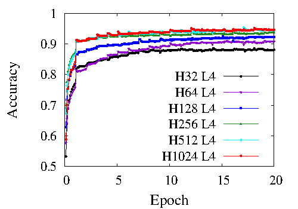
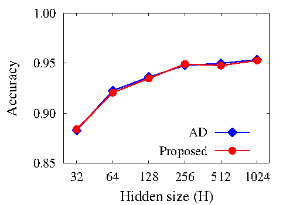
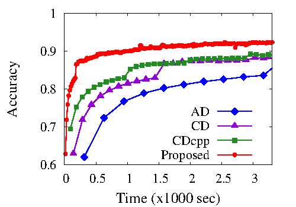
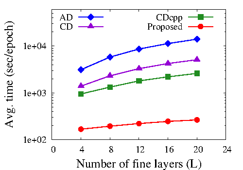

# Reproduce Experimental Results in ICCAD 2021
This includes the [codes](./Codes) for reproducing the results in ICCAD2021 paper
and the sample [results](./Results) that include the log files 
generated when the codes were executed and the figures displayed below.

|Fig. 7a|Fig. 7b|
|---|---|
|||

|Fig. 8|Fig. 9|
|---|---|
|||
